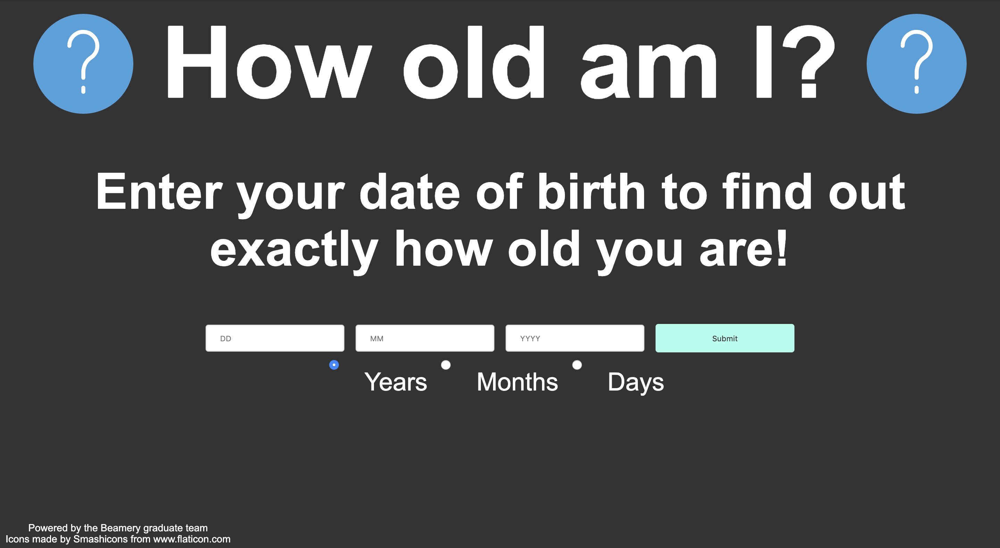

# Project 1 Website: Tom Galligan and Martha Lambert
Website created for week 1 of FAC training 

Available here: https://facxbeamery.github.io/project1/

## Motivation
The purpose of this project was to put the knowledge we had gained in the Monday and Tuesday sessions into practice. 
This week it was important that our project demonstrated understanding of git, responsive design, accessibilty, and DOM manipulation.

## User Journey

As a user I want to find out my age in a variety of units based on my birthdate, so that I can learn a new fact. 

### User Stories

* I want to enter my birthdate into a form and be able to choose the unit of the result so that I can learn about specific dates 
* I want to be told if my input is invalid so that I know if I have made a mistake
* I want to know how many days it is until my birthday so that I can prepare
* I want to see a dynamic output that changes based on my input so that I can view information specific to me. 
* I want to be able to use the website on my phone, or on a variety of screen sizes, so that I can easily use the website in any situation
* As a user with limited vision, I want the website to be accessible so if I'm using a screenreader I get the same experience of the website as others

## Bugs/Improvements
* Would be better if there was no need to click submit, and output automatically updates when input fields are changed
* Site could be more aesthetically pleasing
* Some smooth animations on the site could improve the user experience 
